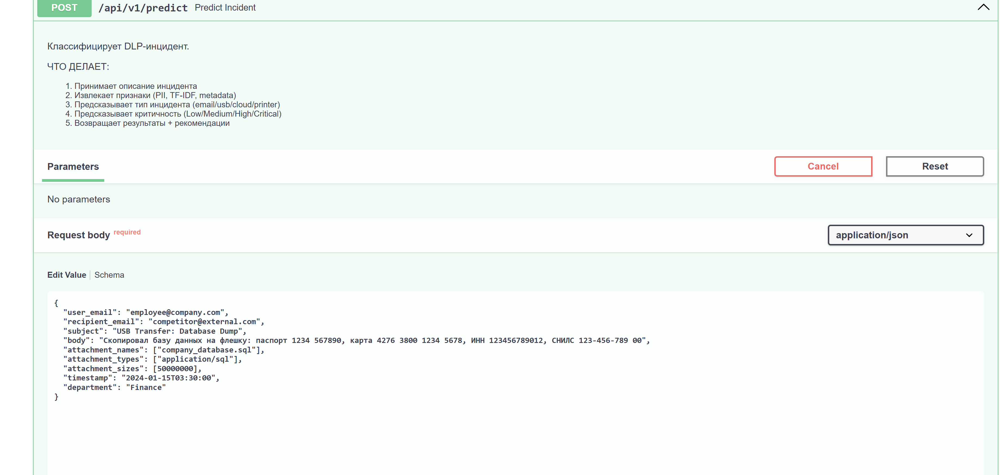
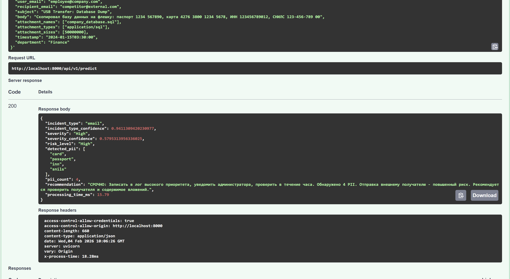

# DLP AI Monitor

Система машинного обучения для автоматической классификации инцидентов утечки данных.

## Описание

Анализирует попытки передачи данных и определяет:
- Тип инцидента (email, usb, cloud, printer)
- Уровень критичности (Low, Medium, High, Critical)
- Наличие персональных данных (номера карт, паспорта, ИНН, СНИЛС)
- Рекомендации по действиям

## Архитектура
```
Инцидент 
   ↓
Feature Extraction (64 признака: TF-IDF + PII + время + метаданные)
   ↓
┌─────────────────┬─────────────────┐
│  CatBoost №1    │  CatBoost №2    │
│  Тип инцидента  │  Критичность    │
│  100% accuracy  │  53% accuracy   │
└─────────────────┴─────────────────┘
   ↓
PII Detector (regex поиск персональных данных)
   ↓
Генерация рекомендации (правила на основе результатов)
   ↓
Результат
```

**Обучено на 30 000 синтетических DLP-инцидентов**

## Входные данные
```json
{
  "user_email": "employee@company.com",
  "recipient_email": "external@gmail.com",
  "subject": "Confidential Report",
  "body": "Паспорт: 1234 567890, Карта: 4276 3800 1234 5678",
  "attachment_names": ["report.xlsx"],
  "attachment_types": ["application/vnd.ms-excel"],
  "attachment_sizes": [2500000],
  "timestamp": "2024-01-15T14:30:00"
}
```

## Выходные данные
```json
{
  "incident_type": "email",
  "incident_type_confidence": 0.9999,
  "severity": "High",
  "severity_confidence": 0.67,
  "detected_pii": ["passport", "card"],
  "pii_count": 2,
  "recommendation": "СРОЧНО: Записать в лог высокого приоритета, уведомить администратора. Обнаружено 2 PII. Отправка внешнему получателю - повышенный риск.",
  "processing_time_ms": 15.5
}
```

## Быстрый старт

### Docker
```bash
git clone https://github.com/parya61/dlp-ai-monitor.git
cd dlp-ai-monitor
docker-compose up --build
```

Откройте http://localhost:8000/docs

### Локальный запуск
```bash
pip install -r requirements.txt
uvicorn api.main:app --reload --host 0.0.0.0 --port 8000
```

Откройте http://localhost:8000/docs

## Пример использования
```bash
curl -X 'POST' \
  'http://localhost:8000/api/v1/predict' \
  -H 'Content-Type: application/json' \
  -d '{
  "user_email": "employee@company.com",
  "recipient_email": "competitor@external.com",
  "subject": "Confidential: Q4 Financial Report",
  "body": "Паспорт: 1234 567890, Карта: 4276 3800 1234 5678",
  "attachment_names": ["report.xlsx"],
  "timestamp": "2024-01-15T03:00:00"
}'
```
### Пример запроса


### Пример ответа


## Технологии

**Machine Learning:**
- CatBoost
- scikit-learn
- pandas, numpy
- TF-IDF

**API:**
- FastAPI
- Pydantic
- Uvicorn

**NLP:**
- spaCy
- Regex

**Infrastructure:**
- Docker
- Python 3.10

## Метрики

| Метрика | Значение |
|---------|----------|
| Incident Type Accuracy | 100% |
| Severity Accuracy | 53% |
| Low Severity Recall | 87% |
| Critical Severity Recall | 98% |
| Processing Time | 10-23ms |
| Training Data | 30 000 инцидентов |
| Features | 64 признака |

## Структура проекта
```
dlp-ai-monitor/
├── api/
│   ├── main.py
│   ├── schemas.py
│   └── dependencies.py
├── src/
│   ├── ml/
│   ├── nlp/
│   └── utils/
├── data/
│   ├── models/
│   └── processed/
├── Dockerfile
├── docker-compose.yml
└── requirements.txt
```

## Сценарий использования

Сотрудник отправляет письмо с конфиденциальными данными внешнему получателю ночью.

DLP система:
1. Перехватывает письмо перед отправкой
2. Отправляет данные в ML API
3. Получает классификацию: severity = "Critical", pii_count = 2
4. Блокирует отправку и уведомляет службу безопасности

## Автор

Parya - [GitHub](https://github.com/parya61)

